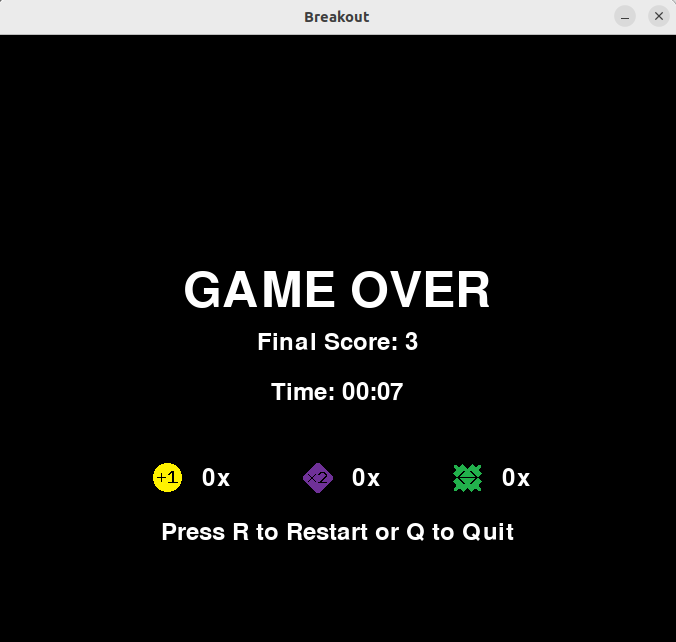

## Projeto P1 - BREAKOUT

### Logo do game


### Resumo do Jogo

Este é um projeto para a disciplina de Introdução à Programação na Universidade Federal de Pernambuco (UFPE). É uma variação do clássico jogo "Breakout". O objetivo do jogo é destruir todos os blocos na tela usando uma bola que rebate em uma raquete controlada pelo jogador. A bola deve ser mantida em jogo o máximo possível, evitando que ela caia abaixo da raquete.

### Membros e Suas Contribuições

- **Lucas Vinícius**: Desenvolvimento e planejamento da lógica geral do jogo, parte da física e resolução de bugs, controle da barra e movimento da bola.
- **Juan Henrique**: Design visual, classes dos objetos e suas propriedades, criação dos assets de jogo, incluindo blocos, barra, bola, e power-ups.
- **Victor Daniel**: Implementação de parte da física do jogo, incluindo detecção de colisão dos blocos, música de fundo e efeitos sonoros.
- **Levi Serrano**: Desenvolvimento e implementação de power-ups e suas funcionalidades.

### Objetos

- **Barra**: Controlada pelo jogador usando as setas do teclado. A barra se move horizontalmente na parte inferior da tela e é usada para rebater a bola.
  
- **Bola**: Uma esfera que se move pela tela, rebatendo nas bordas, na barra e nos blocos. O jogador deve evitar que a bola caia abaixo da barra.

- **Blocos**: Objetos estáticos que a bola deve destruir para o jogador ganhar pontos.

- **Ball Duplicate (Multiplicador de Bolas)**: Um power-up que duplica o número de bolas em jogo, aumentando a dificuldade e o potencial de destruição de blocos.

- **Extra Ball (Bola extra)**: Um power-up que adiciona uma bola a mais em campo.
  
- **Extend Bar (Aumento de Barra)**: Um power-up que aumenta temporariamente o tamanho da barra, facilitando o controle da bola.

### Fluxograma Lógico do Código


### Ferramentas, Bibliotecas, Frameworks e Conceitos de Programação Aplicados no Projeto

- **Linguagem de Programação**: Python
- **Biblioteca**: Pygame
- **Conceitos de Programação**: Orientação a Objetos, Detecção de Colisões, Física de Jogo, Animações, Gerenciamento de Estados

### Desafios e Aprendizados ao Longo do Projeto

- Desafios enfrentados na implementação da física da bola e na detecção de colisões precisas.
- Aprendizados significativos sobre o uso de bibliotecas gráficas e sonoras, como a Pygame.
- Melhor compreensão de como criar uma experiência de usuário fluida e envolvente através de design visual e som.

### Capturas do Jogo

<p align="center">
  
  
</p>
<p align="center">
  
  
</p>


---

## README do Projeto "Breakout"

### Descrição do Projeto

(*[Descrição do projeto]*)

### Pré-requisitos

- Python 3.x
- Pygame

### Instalação

```bash
# Clonar o repositório
git clone <URL_DO_REPOSITÓRIO>

# Navegar até o diretório do projeto
cd breakout-py

# Instalar as dependências
pip install pygame


### Como Jogar

1. Inicie o jogo executando o script principal:
   ```bash
   python main.py
   ```
2. Use as setas do teclado para mover a barra.
3. Pressione "Espaço" para lançar a bola.
4. O objetivo é destruir todos os blocos na tela.

### Contribuições

(*[Instruções para quem deseja contribuir com o projeto]*)

### Licença

(*[Informações sobre a licença do projeto]*)

### Contato

(*[Informações de contato da equipe]*)
